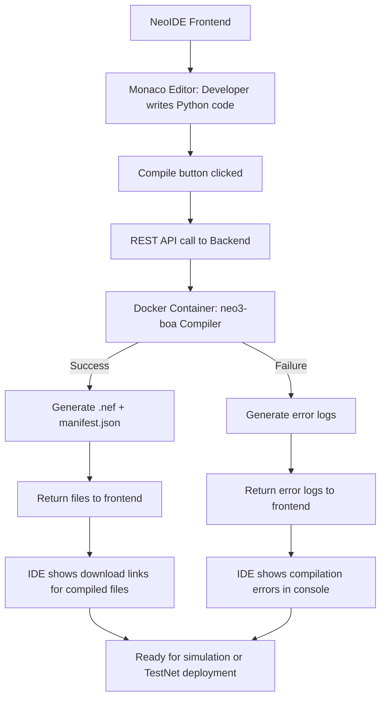

```mermaid
graph TD
  A[NeoIDE Frontend] --> B[Monaco Editor: Developer writes Python code]
  B --> C["Compile" button clicked]
  C --> D[REST API call to Backend]
  D --> E[Docker Container: neo3-boa Compiler]
  
  E -->|Success| F[Generate .nef + manifest.json]
  E -->|Failure| G[Generate error logs]

  F --> H[Return files to frontend]
  G --> I[Return error logs to frontend]

  H --> J[IDE shows download links for compiled files]
  I --> K[IDE shows compilation errors in console]

  J --> L[Ready for simulation or TestNet deployment]
  K --> L
```
